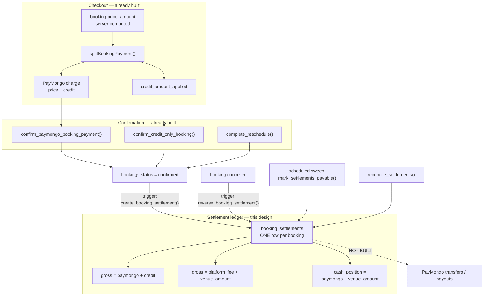

# AIR/Rally Settlement Ledger

Design notes for `booking_settlements` (migration `20260810000039_settlement_ledger.sql`).
**No payout or transfer logic exists yet.** This document and that migration record
what each venue is owed; moving money is a separate, later decision.

---

## 1. Audit: what existed before

| Question | Answer before this ledger |
| --- | --- |
| Where is venue entitlement recorded? | Nowhere. |
| What are `bookings.venue_amount` / `platform_fee_amount`? | Written **only** when the marketplace-split gate is on *and* the venue has an activated PayMongo Platforms account. No venue is activated, so both are `NULL` on every real booking. |
| Do they mean "the venue was paid"? | No. `venueEarnings.ts` documents them as "the requested split, not a confirmation that PayMongo actually settled." |
| Where does customer money go? | Entirely into the AIR/Rally platform PayMongo account. |
| Can refunds be automated? | No. QR Ph payments cannot be refunded through PayMongo's API (`REFUND_UNSUPPORTED_SOURCE_TYPES` in `refunds.ts`). Every remedy today is AIR/Rally Credits or a manual transfer. |

**Conclusion:** the platform collects all money and holds no durable record of what it owes.
That is fine while nothing is paid out, and unworkable the moment transfers begin.

### The problem AIR/Rally Credits introduce

A booking paid entirely in credits collects **zero pesos today**, but the venue is still
owed its 95%. The cash to pay that venue comes from money collected earlier against a
*different* booking.

Entitlement and cash receipt are therefore different quantities. A ledger that conflates
them will overstate what the platform can afford to pay out. Keeping them separate is the
single reason this table has the shape it does.

---

## 2. Architecture



The ledger hangs off `bookings.status = 'confirmed'`, not off any individual checkout
path. That is deliberate: a future payment route cannot forget to produce a settlement,
because it necessarily confirms the booking to succeed at all.

---

## 3. Database design

`booking_settlements`, one row per booking, created at confirmation.

| Column | Meaning |
| --- | --- |
| `booking_id` | Unique. One settlement per booking, enforced by the database. |
| `venue_id` | Who is owed. Resolved from the court at creation time. |
| `gross_booking_amount` | The booking's full price — the customer's obligation, before any question of funding. |
| `paymongo_amount` | Cash actually collected through PayMongo. |
| `credit_amount` | Value settled from the customer's wallet. Real entitlement, **not** cash received now. |
| `platform_fee` | AIR/Rally's 5%, of **gross** — not of the cash portion. |
| `venue_amount` | The venue's 95%, of gross. |
| `fee_percent_applied` | The rate this row was computed under, so a later rate change leaves history intact. |
| `settlement_source` | `paymongo` \| `credit` \| `mixed`. Derived from the amounts, never independently asserted. |
| `settlement_status` | `pending` → `payable` → `settled`, or `reversed` / `on_hold`. |
| `cash_position` | Generated: `paymongo_amount − venue_amount`. **Negative = the platform owes more cash than this booking brought in.** |

### The two identities

Both are `CHECK` constraints, so no code path — present or future — can write a row that
doesn't balance:

```
paymongo_amount + credit_amount = gross_booking_amount     (how it was funded)
platform_fee    + venue_amount  = gross_booking_amount     (how it is divided)
```

A third constraint ties `settlement_source` to the amounts, so the label can never drift
from what it describes.

Integer minor units throughout. The fee is rounded once and the venue's share is the
remainder by subtraction — the same discipline as `calculateMarketplaceSplit()` — so the
two sum to gross exactly for every input, as a property of the arithmetic rather than
something needing a runtime assertion.

### The three funding shapes

For a ₱500 booking at a 5% platform fee:

| Shape | `paymongo` | `credit` | `platform_fee` | `venue_amount` | `cash_position` |
| --- | ---: | ---: | ---: | ---: | ---: |
| PayMongo-only | ₱500 | ₱0 | ₱25 | ₱475 | **+₱25** |
| Credit-only | ₱0 | ₱500 | ₱25 | ₱475 | **−₱475** |
| Mixed (₱300 credit) | ₱200 | ₱300 | ₱25 | ₱475 | **−₱275** |

The venue is owed ₱475 in all three cases. What changes is whether the platform is
holding the cash to pay it.

### Status lifecycle

| Status | Meaning |
| --- | --- |
| `pending` | Booking confirmed, court time not yet delivered. A liability, not yet earned. |
| `payable` | Court time delivered. The venue has earned this. |
| `settled` | Paid out. **Reserved — nothing writes this yet.** |
| `reversed` | Booking cancelled before settlement. Entitlement withdrawn. |
| `on_hold` | Needs a human. Currently only reached by cancelling an already-settled booking. |

Entitlement is earned when the court time is **delivered**, not when the customer pays.
A booking confirmed three weeks out is a liability for those three weeks. Since a trigger
cannot fire on the passage of time, `mark_settlements_payable()` is a sweep intended for a
schedule; it is idempotent, so running it often costs nothing.

### Access

Venue owners read their own settlements. Admins read all. **No INSERT/UPDATE/DELETE policy
exists for any client role, including admins** — the same posture as `credit_transactions`.
Every row is written by triggers and privileged functions, so a compromised session of any
role cannot invent, revalue, or retire an entitlement.

---

## 4. Reconciliation rules

`reconcile_settlements()` returns one row per problem and nothing when the ledger is
sound. This is a function rather than a checklist because rules that are only written
down do not get checked. **A payout run must pass it before moving money.**

| Rule | Detects |
| --- | --- |
| `missing_settlement` | A confirmed, priced booking with no settlement row. |
| `funding_mismatch` | A settlement whose amounts no longer agree with its booking — drift between `credit_amount_applied` and the ledger. |
| `live_settlement_on_cancelled_booking` | A cancelled booking still carrying `pending`/`payable` entitlement. |
| `unfunded_entitlement` | Live entitlement with `cash_position < 0`. |

The last one is **not an error** — it is the expected shape of every credit-funded
booking. It is reported because it is the platform's own cash exposure, and the sum of
`cash_position` across unsettled rows is the number to look at before enabling payouts.

Two rules deliberately absent, because nothing can enforce them yet:

- **Bank reconciliation** — matching `paymongo_amount` totals against PayMongo's own
  settlement reports. Needs the payouts API, which is unverified.
- **Fee-net verification** — PayMongo's processing fee is deducted before funds land, so
  actual cash received is slightly below `paymongo_amount`. `pass_on_fees` behaviour is
  still unconfirmed, so modelling it now would be guessing.

---

## 5. Cancellation handling

A cancelled booking's entitlement is **withdrawn, never deleted** — the row remains as
evidence that it existed and was reversed, with `reversed_at` and a reason.

| Booking state at cancellation | Settlement becomes |
| --- | --- |
| `pending` (never confirmed) | No settlement was ever created. Nothing to do. |
| `confirmed`, settlement `pending` or `payable` | `reversed` |
| `confirmed`, settlement already `settled` | `on_hold` — money has left; clawing it back is a human decision, not something to do silently. |

Reversal is **all-or-nothing, not partial**. With QR Ph, refunds cannot be executed
through PayMongo's API at all, so every customer-side remedy today is either AIR/Rally
Credits or a manual transfer. Modelling partial venue clawbacks before either mechanism
exists would be inventing rules nothing can enforce.

Note the asymmetry, which is intentional: the **customer's** remedy follows the 48-hour
credit policy in `resolveCancellationCredit()`, while the **venue's** entitlement reverses
whenever the booking does. A customer who cancels late forfeits their payment, and that
forfeited amount stays with the platform rather than accruing to the venue. If venues
should share in late-cancellation revenue, that is a commercial decision to make
explicitly — it is not the current behaviour.

---

## 6. Reschedule handling

A reschedule cancels the original booking and confirms a replacement. Both triggers fire
naturally:

- the original's settlement → `reversed`
- the replacement gets its **own** settlement, priced independently

This matches how `venueEarnings.ts` already treats a replacement — "its own independent
snapshot, not derived from the original it replaced." No settlement-specific reschedule
logic was needed, which is the outcome worth having: the ledger follows booking state, and
rescheduling is already expressed in booking state.

A price-increase reschedule charges only the difference through PayMongo, but the
replacement's settlement records its **own full gross**, and the original's reverses in
full. Entitlement across the pair is therefore the replacement's price, not the sum of
both — verified on staging.

---

## 7. Verification

`scripts/verify-staging-settlements.ts` — **45/45 checks pass** against staging: all three
funding shapes, both arithmetic identities (including rejection of deliberately unbalanced
and mislabelled rows), the payable sweep and its idempotency, cancellation reversal,
the reschedule pair, all four reconciliation rules, and RLS from four different
perspectives.

---

## 8. Not built, deliberately

- **PayMongo transfers/payouts.** No API call, no `settled` writer.
- **Payout batching**, minimum thresholds, payout schedules.
- **Processing-fee modelling** — see reconciliation above.
- **Partial reversals** — see cancellation above.
- **Any UI.** No owner-facing or admin-facing settlement view exists yet.
