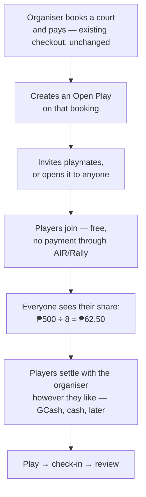

# Open Play — organiser books, players settle up themselves

**Status: design only. No code written.**

One person books and pays. Whether they split the cost, who with, and how, is entirely up to
them. AIR/Rally holds the court, manages the roster, and tells everyone what their share
*would* be — it does not collect it.

---

## What changed from the first draft, and why it's better

The first version had AIR/Rally collecting each player's share into a pot and confirming the
booking when it filled. That is out.

The revised model removes, in one stroke:

- the contribution ledger and pot-completion logic
- per-share checkout and its refund paths
- the "player dropped out and wasn't replaced" refund dispute — the worst UX in the old design
- every question about AIR/Rally holding money on behalf of one user for another
- the dependency on credits, which almost no user has a balance in anyway

What remains is the part that actually beats a group chat, and it was never the payment
collection.

---

## Why this still beats a Messenger thread

A group chat cannot:

1. **Hold the court.** This is the whole thing. Someone has to book, and the booking is real.
2. **Keep an accurate roster.** Who is actually in, not who reacted with 👍 and forgot.
3. **Run a waitlist.** `promote_event_waitlist()` already exists — when someone drops, the next
   person is in, automatically.
4. **Do the arithmetic.** ₱500 ÷ 8 = ₱62.50, shown to everyone, updated as the roster changes.

Payment collection was a nice-to-have on top. Dropping it costs surprisingly little and removes
most of the risk.

---

## The flow

The organiser's booking and payment path is **completely unchanged**. No new money flow exists
anywhere in this feature.

---

## What AIR/Rally does and does not do

| Does | Does not |
| --- | --- |
| Holds the court with a real booking | Collect anyone's share |
| Manages who's in, who's waitlisted | Guarantee the organiser gets paid back |
| Shows each player their share | Hold money for one user on behalf of another |
| Lets the organiser nudge people about what they owe | Process, route, or refund a split payment |
| Records who actually turned up | Take a cut of the split |

**This distinction has to be visible in the UI, not just true in the code.** If the app displays
"₱62.50 each" and offers a "request payment" button, a reasonable person may assume AIR/Rally is
handling it. It isn't. The wording needs to say so plainly — *"Settle up directly with
{organiser}"* — or the first time someone doesn't get paid back, they'll blame the app.

---

## The share calculator

Show `booking price ÷ confirmed players`, recalculated live as the roster changes.

Two decisions worth making deliberately:

**Does the organiser count as a player?** Almost certainly yes — they're playing too. ₱500 ÷ 8
including the organiser, not ₱500 ÷ 7 others. Worth being explicit because it's the kind of
thing that quietly annoys people.

**Does the share update as people join?** If it shows ₱83.33 at 6 players and ₱62.50 at 8, early
joiners see the number drop, which is pleasant. But if someone drops out it goes *up*, which
feels like a bait and switch. I'd show the current per-head figure prominently and the target
figure as context: *"₱62.50 each when full · ₱83.33 with 6 players today."*

---

## The "request" to a playmate

Two different things could be meant by this, and they're worth separating:

**An invite** — "join my game Thursday 7pm." Goes to a specific person or a club, creates a
roster spot, uses the existing notification system.

**A settle-up nudge** — "you owe me ₱62.50 for Thursday." A reminder, not a charge. Ideally it
produces something the organiser can actually send: a message with the amount, the game, and the
organiser's own GCash details if they've chosen to save them.

I'd build the invite in v1 and treat the nudge as optional polish. The nudge is where the
"is AIR/Rally handling this?" confusion lives, so it needs the most careful copy for the least
functional gain.

---

## Failure cases — much shorter now

| Case | Behaviour |
| --- | --- |
| Nobody joins | The organiser has a court booked and can cancel under the normal 48-hour policy |
| Player joins then drops | Roster spot frees, waitlist auto-promotes, share recalculates |
| Player doesn't pay the organiser back | **Not AIR/Rally's concern.** No mechanism, no mediation, and the UI should never imply otherwise |
| Organiser cancels the booking | Existing cancellation policy and credit rules apply, unchanged |
| Venue cancels | Existing policy, unchanged |

The entire "pot didn't fill" branch is gone, along with the deadline sweep and the court-holding
cap that existed only to bound an unfunded pending booking.

---

## What this needs

New: an Open Play creation UI on top of an existing booking, an invite flow, a roster view with
the share calculator, and a join/leave path.

Reused unchanged: `createEventAction`, `event_attendees`, capacity, `promote_event_waitlist()`,
notifications, and the entire booking and payment stack.

**No new tables. No new money flow. No changes to the settlement ledger, credits, or checkout.**

---

## Dependency

Still blocked on the same thing: **nothing in the app currently calls `createEventAction` and
there is no `/events` route.** The 7.8a backend — capacity, waitlist, RLS, notifications — has no
front door. That is the first build, and it's mostly UI against services that already exist.

---

## Open questions

1. **Can anyone join, or invite-only?** Or per-event choice — public, club-only, invite-only?
   Public is what grows the network; invite-only is what people will actually use first.
2. **Does the organiser save GCash details** for the settle-up nudge? Useful, but it means
   storing a payment handle on the profile, which deserves its own thought.
3. **Should a player be able to see the organiser's other games** before joining a stranger's
   session? Relevant to trust, and cheap once the roster exists.
4. **Check-in:** does the organiser mark attendance, or does each player check themselves in?
   This feeds the "Plays" stat and review eligibility, so it's worth getting right.

---

## Deliberately not in v1

Payment collection, organiser payouts, guest joins, recurring cost-split sessions, in-app chat,
and any form of dispute mediation between players.
