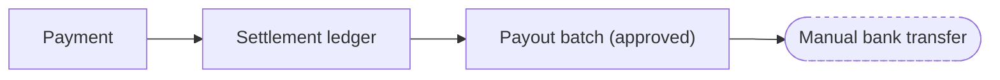

# PayMongo transfers — capability research

Research conducted **August 2026**, against PayMongo's live documentation and AIR/Rally's
own test-mode API key.

> **Transfers are NOT implemented and cannot be executed.** Every provider method throws.
> The adapter is disabled by default and additionally refuses to run against a non-test
> key. No settlement can be marked `settled`.

---

## Headline finding

**The transfer API is reachable and our key is authorised for it — but AIR/Rally has no
wallet, so there is no account to send money *from*.**

Two live probes against `sk_test_…`:

| Probe | Result | Meaning |
| --- | --- | --- |
| `POST /v2/batch_transfers` with `{"transfers":[]}` | `400 {"code":"invalid_request_body","detail":"transfers is required"}` | Route exists, auth accepted, body validated. **Not** 404 or 403. |
| `GET /v2/wallets/` | `200 {"data":[]}` | **Zero wallets.** No `source_account` can be constructed. |

This is a provisioning blocker, not an engineering one. The capability is not switched on
for this account.

*(Path note: `/v2/batch_transfers/` with a trailing slash answers `307`, and `/v2/wallets`
without one answers `301`. Paths must be sent exactly as written above.)*

---

## The eight questions

**1. Can AIR/Rally transfer funds from the platform account to venue accounts?**
Not today. The API exists and accepts our credentials, but with no wallet there is no
source account. Even once a wallet exists, the destination must be a bank/e-wallet account
reachable over InstaPay or PesoNet — or another PayMongo wallet.

**2. Is PayMongo Platforms required?**
Not for transfers. These are two different products, and conflating them is the main trap:

- **Platforms** governs onboarding child merchants and **splitting a payment at capture
  time**. An earlier phase verified `split_payment` works for real.
- **Money Movement** governs **moving funds you already hold** out to a bank, e-wallet or
  another wallet. This is what a payout needs, and it depends on a wallet — not on
  Platforms.

**3. What API endpoint performs transfers?**
`POST /v2/batch_transfers`. Body:

```
{ "transfers": [ {
    "source_account":      { "number", "name", "bic" },
    "destination_account": { "number", "name", "bic" },
    "amount", "currency", "provider",
    "reference_number", "purpose", "description",
    "callback_url", "metadata"
} ] }
```

`provider` ∈ `paymongo` | `instapay` | `pesonet`; `bic` is `PAEYPHM2XXX` for PayMongo.
Reads: `GET /v2/transfers/{id}`, `GET /v2/batch_transfers/{id}`.

**4. What authentication is required?**
HTTP Basic — secret key as username, empty password. Same scheme as the rest of the API.

**5. What webhook events confirm success?**
`payout.deposited` and `payout.returned`. Individual transfers may also carry a
`callback_url` which receives status transitions directly.

**6. What happens when transfers fail?**
The transfer's status becomes `failed`. Test mode provides magic destination account
numbers to simulate outcomes:

| Destination number | Result |
| --- | --- |
| `999999990001` | succeeded |
| `999999990002` | generic failure |
| `999999990003` | account not found |
| `999999990004` | inactive account |
| `999999990005` | account limit exceeded |
| `999999990006` | provider-side internal error |

Any other number is a no-op: the transfer **stays `pending` forever**. That matters — an
unrecognised destination does not error, it silently hangs.

**7. Can transfers be reversed?**
**No reversal or cancellation endpoint is documented anywhere.** Transfer statuses are only
`pending`, `succeeded`, `failed`. Treat every sent transfer as irreversible.

**8. What idempotency guarantees exist?**
**None documented — and the official guidance actively works against safety.**

The API reference documents no `Idempotency-Key` header for transfers, while the
money-movement guide advises using *"a new, unique reference_number on retry"*. Following
that literally would create a second transfer, and if the first had actually succeeded, the
venue is paid twice. Separately, the go-live checklist says to *"implement idempotency keys
and retry logic"* — so PayMongo's own documentation is internally inconsistent here.

**This is the single most important finding in this document**, and it is why AIR/Rally
does not delegate retry safety to the provider.

---

## How AIR/Rally compensates

Since the provider offers no idempotency, our database provides it:

1. `payout_transfers.reference_number` is **unique in our database**, generated once per
   transfer row and **never regenerated on retry**.
2. A partial unique index allows only one live transfer per `(batch, venue)` — a second
   row for the same pair is rejected outright.
3. `decideTransferRetry()` never returns `send` once anything has been dispatched. Where
   the provider id is missing and status is `processing` — the timeout case — it returns
   `lookup_first`.
4. `findTransferByReference()` exists on the provider interface *specifically* so a
   timed-out transfer can be resolved by asking "did my reference already go through?"
   rather than guessing.

The admin transfers page deliberately has **no retry button**.

---

## Flow

**Today:**



**Future:**

```mermaid
flowchart LR
    A["Payout batch (approved)"] --> B["payout_transfers row<br/>written FIRST"]
    B --> C["POST /v2/batch_transfers"]
    C --> D["Venue bank / e-wallet"]
    D --> E["payout.deposited webhook"]
    E --> F["Verify via GET /v2/transfers/{id}"]
    F --> G["settlement_status = settled"]

    style C stroke-dasharray: 4 4
    style D stroke-dasharray: 4 4
    style E stroke-dasharray: 4 4
    style F stroke-dasharray: 4 4
    style G stroke-dasharray: 4 4
```



The row is written **before** the provider call. The dangerous failure is not "the transfer
failed" — it is "we sent a transfer and then crashed before recording it", because the
retry then pays twice.

Note that `settled` is reached from the **verified provider status**, never from the
`createTransfer` response. Asking for money to move is not evidence it moved — the same
discipline the booking flow already applies to payments.

---

## Risks

| Risk | Severity | Mitigation in place |
| --- | --- | --- |
| No provider idempotency → double payment | **High** | Unique reference in our DB, partial unique index, retry decision function, no retry button |
| No reversal endpoint | **High** | Nothing can execute a transfer; every send must be treated as final |
| Unrecognised destination hangs in `pending` | Medium | Needs a staleness sweep before enabling — **not built** |
| Doc inconsistency on idempotency | Medium | Resolved by not trusting the provider for it |
| Live key used during sandbox work | **High** | Adapter refuses any non-`sk_test` key, independently of the flag |
| Processing fees unmodelled | Medium | Unresolved — see below |

---

## Required before enabling payouts

1. **A PayMongo wallet must be provisioned.** Nothing else can proceed. Contact
   `support@paymongo.com`; the wallet must be *Enabled, not Closed-loop*.
2. **Sandbox transfer executed end-to-end** using the magic destination numbers above —
   success, failure, and the no-op hang.
3. **Confirm idempotency behaviour empirically.** Send the same `reference_number` twice
   and observe whether PayMongo dedupes or creates two transfers. Documentation cannot
   answer this; only a test can.
4. **Model processing fees.** PayMongo deducts fees before funds land, so cash received is
   below the recorded `paymongo_amount`. Minimum payout to a bank account is **PHP 80.00**.

   > ⚠️ **UNVERIFIED — August 2026 re-check.** The PHP 80.00 minimum could not be
   > confirmed against any PayMongo public source: not the pricing page, not the
   > wallet page, not the Money Movement API docs. It may have come from a support
   > conversation or a dashboard message, but it is not published, so **do not enforce
   > a payout floor on this figure** until PayMongo confirms it.
   >
   > **The transfer fee is SETTLED: PHP 10, verified by observation 2026-08-26.** The
   > founder made real transfers on their own PayMongo account and PHP 10 was charged
   > on **both PESONet and InstaPay**. PayMongo's own pages had contradicted each
   > other — the pricing page says "PHP 10 per transaction (via InstaPay or PesoNET)"
   > (correct), while the wallet page says "Standard bank transfers via PESONet are
   > free" and calls batch disbursements "free" (**wrong — do not trust that page on
   > fees**), and the API docs show a PHP 8.00 worked example (an example, not a
   > rate). Recorded so nobody re-opens it. See `src/lib/payouts/transferFee.ts`.
5. **Build the stale-transfer sweep** for transfers stuck `pending`.
6. **Verify webhook signatures** for `payout.deposited` / `payout.returned` — the existing
   checkout webhook route's discipline applies unchanged.
7. **Fund the credit exposure.** `/admin/finance` shows entitlement funded by credits
   rather than cash. That figure being visible is not the same as the cash existing.

---

## Sources

- [Money Movement — moving money with API](https://docs.paymongo.com/docs/money-movement-moving-money-with-api)
- [Create batch transfer](https://docs.paymongo.com/reference/create-batch-transfer)
- [Transfer resource](https://docs.paymongo.com/reference/transfer-resource)
- [Transfer test cases](https://docs.paymongo.com/docs/transfer-test-cases)
- [Money Movement go-live checklist](https://docs.paymongo.com/docs/money-movement-go-live-checklist)
- [Webhook events](https://docs.paymongo.com/docs/developer-tools-webhooks-events)
- [PayMongo Platforms](https://www.paymongo.com/products/platform)
- [PayMongo Money Movement](https://www.paymongo.com/money-movement)

Live probes were run against `https://api.paymongo.com` with AIR/Rally's own test key.
