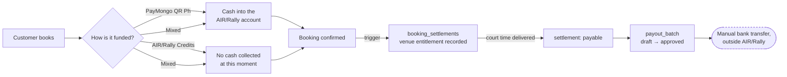
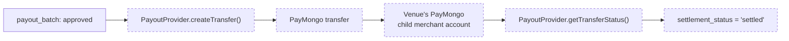

# Payout readiness

How money reaches AIR/Rally today, and where a future PayMongo payout would plug in.

> **Payout execution is NOT IMPLEMENTED.** Nothing in AIR/Rally can send money to a
> venue. No settlement can reach `settled`. Every method on the payout provider throws.
> This document describes what exists and what is deliberately missing.

---

## What happens today



Every step above is built and verified. The last one is a human doing a bank transfer:
AIR/Rally records what is owed, and a person pays it.

## What a future payout would add



**Everything dashed is NOT IMPLEMENTED.**

Note which arrow marks a settlement `settled`: the *status poll*, not the response to
`createTransfer`. This mirrors the discipline the booking payment flow already uses — the
thing that confirms money moved is never the request that asked for it.

---

## Two different questions about a venue

These are easy to conflate and must not be:

| | Question | Owned by | Stored in |
| --- | --- | --- | --- |
| **Checkout** | Can a customer's payment be split to this venue? | PayMongo | `venues.paymongo_activation_status` |
| **Payout** | Will AIR/Rally send money to this venue? | AIR/Rally | `venue_payment_accounts.status` |

PayMongo activation is **necessary but not sufficient**. An admin may restrict a venue
during a dispute without anything changing at PayMongo.

To avoid two answers to "can this venue be paid", the PayMongo facts have a single writer:
`venue_payment_accounts.paymongo_account_id` and its baseline status are **mirrored from
`venues` by a database trigger**, never typed in. The only independently-owned state is the
admin's restrict/disable decision — and that decision deliberately survives a later
PayMongo update, so re-activation at PayMongo cannot silently undo it.

### Status mapping

| `venues.paymongo_activation_status` | → `venue_payment_accounts.status` |
| --- | --- |
| `unlinked` | `not_connected` |
| `pending`, `under_review` | `pending_verification` |
| `activated` | `verified` |
| `declined` | `restricted` |
| *(admin decision)* | `restricted`, `disabled` — overrides the mirror |

Only `verified` allows a settlement into a payout batch.

---

## The eligibility chain

A settlement can enter a payout batch only if **all** of these hold:

1. `settlement_status = 'payable'` — the court time was delivered, so the venue earned it
2. the venue's payment account is `verified` — there is somewhere to send it
3. it is not already in a live batch — no double payment
4. the ledger reconciles — `reconcile_settlements()` returns no errors

Rules 1–3 are enforced by a database trigger on `payout_batch_items`, so they hold even if
a settlement id is passed in directly, bypassing the admin UI entirely. Rule 4 is checked
by the server action before a batch is created.

A **negative cash position** is deliberately *not* in that list. Operating at a negative
cash position is the expected shape of a credits business; it warns rather than blocks,
because making it an error would teach admins to route around the check that matters.

---

## The provider seam

`lib/services/payoutProvider.ts` defines the interface; `lib/services/providers/paymongo.ts`
implements it by throwing.

```ts
interface PayoutProvider {
  readonly implemented: boolean;   // false
  createTransfer(request): Promise<TransferResult>;      // throws
  getTransferStatus(id): Promise<TransferStatus>;        // throws
  cancelTransfer(id): Promise<void>;                     // throws
}
```

Throwing is the design, not an unfinished state. A method that returned a plausible-looking
result would be far more dangerous, because a caller written against it would appear to
work while paying nobody.

The provider module makes **no network call**, reads **no API key**, and does **not import
the checkout client** — all three are asserted by tests, so "no external call is possible"
is structural rather than a promise.

`assertNoPayoutExecutor()` throws if any provider reports `implemented: true`. It passes
today. A future phase that implements transfers will make it fail — deliberately, so
whoever does it must find every place that assumed money could not move.

---

## Remaining blockers before payout execution

| Blocker | Why it blocks |
| --- | --- |
| **No activated venue account** | A payout needs an activated PayMongo Platforms child merchant. None exists, which is also why the marketplace split gate has stayed closed. |
| **Transfer API unverified** | Checkout, `split_payment` and refunds were verified against the real test API. Transfers were not — endpoint shape, idempotency semantics, failure modes and settlement timing are all unconfirmed. |
| **Processing fees unmodelled** | PayMongo deducts its fee before funds land, so cash received is below the recorded `paymongo_amount`. Transferring the full `venue_amount` could overdraw the platform account. |
| **No reversal path** | If a transfer is sent and then fails, nothing knows how to unwind a partially-paid batch. |
| **Credit exposure may be unfunded** | `/admin/finance` shows how much entitlement was funded by credits rather than cash. That number being visible is not the same as the cash existing. |

The first four are engineering work gated on PayMongo confirming capability. The last is a
business question, and it is the one most likely to be overlooked.

---

## Related

- `SETTLEMENT-LEDGER.md` — the ledger design, reconciliation rules, cancellation and reschedule handling
- `supabase/migrations/20260810000039_settlement_ledger.sql` — settlements
- `supabase/migrations/20260810000041_payout_batches.sql` — batches
- `supabase/migrations/20260810000043_venue_payment_accounts.sql` — payout readiness
- `scripts/verify-staging-payment-readiness.ts` — the staging proof
